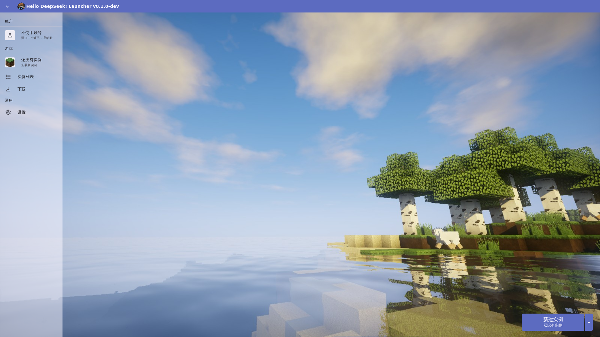
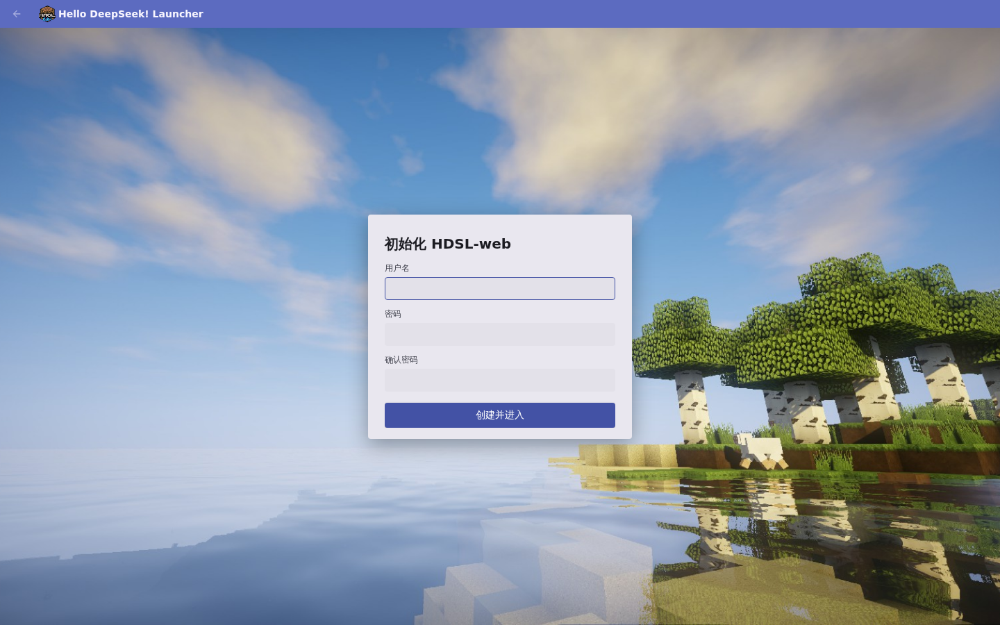
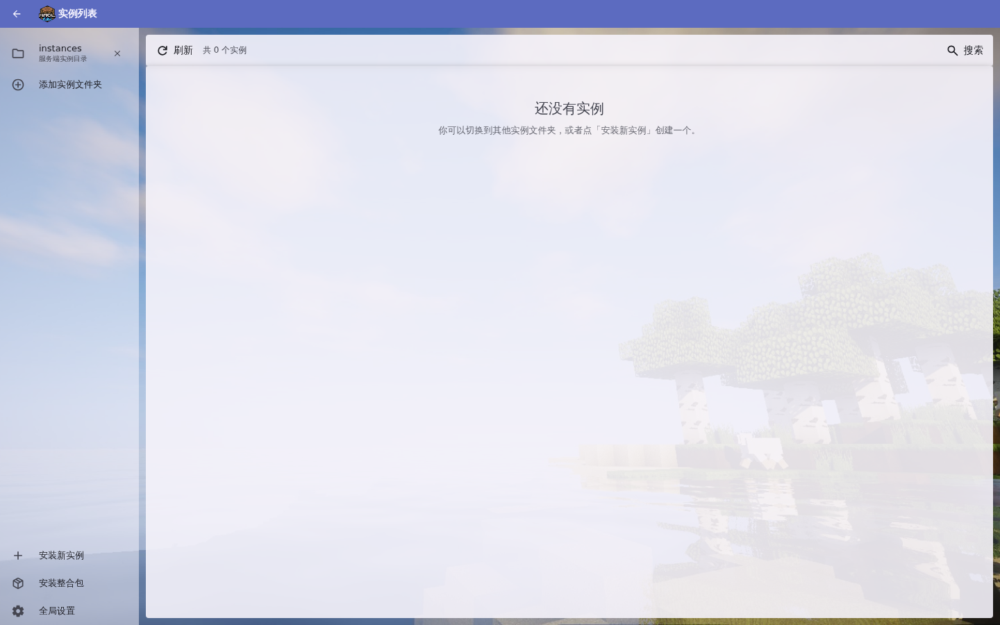
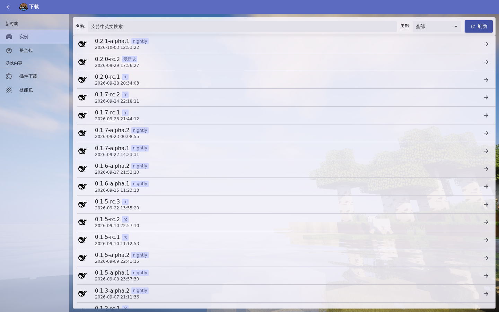
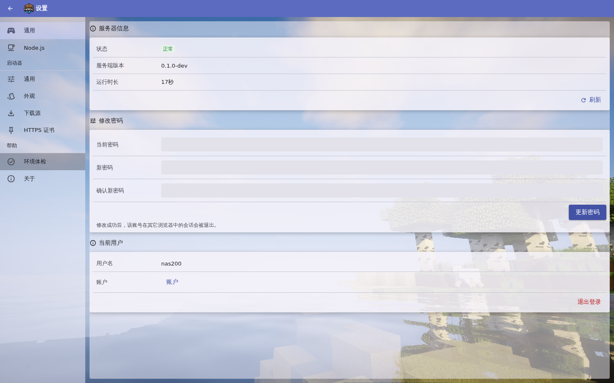

# HDSL-web

[](https://github.com/nas200-timmy/HDSL-WEB/actions/workflows/build.yml)
[](https://github.com/nas200-timmy/HDSL-WEB/releases)
[](LICENSE)
[]()

把 [HDSL](https://github.com/MCXCC303/HDSL)（Hello DeepSeek! Launcher，桌面版）搬进浏览器的**单容器**版本：
打开网页 → 登录 → 傻瓜式创建 dsh 实例 → 点「启动」→ 在**同域名、同端口、同一张证书**下直接使用 dsh 自己的网页界面。
界面按桌面版**像素级复刻**（HMCL 视觉语言、Material You 主题、同款图标与动画），管理功能全部保留：
实例/版本/插件/账户/整合包/会话/技能/体检/ACP 控制台。



- 交付形态：**一个可执行 fat jar**（`java -jar hdsl-web.jar`）+ 一个 Debian 容器镜像。
- jar 之外只需两样东西：**JDK 21+** 和 **Node ^22.19.0 || >=24.0.0 + pnpm**（dsh 由 pnpm 安装、由 node 运行）。

<details>
<summary>更多截图（初始化引导 / 实例列表 / 下载 / 设置）</summary>

| 初始化引导（首启建号） | 实例列表 |
|---|---|
|  |  |

| 下载（真实 npm 版本列表） | 设置 |
|---|---|
|  |  |

</details>

## 目录

- [架构](#架构)
- [快速开始](#快速开始)（Release 下载 / Docker Compose / 裸 `java -jar`）
- [首次登录与初始化引导](#首次登录与初始化引导)
- [数据与挂载点](#数据与挂载点)
- [声明式 HTTPS](#声明式-https)
- [环境变量](#环境变量)
- [安全说明](#安全说明)
- [构建与开发](#构建与开发)
- [常见问题](#常见问题)
- [许可](#许可)

## 架构

```
浏览器标签页 A：HDSL 面板            浏览器标签页 B：dsh web
   https://host:3080（同一张证书、同一端口）
        │                                   │
        ▼                                   ▼
┌─ 单个容器（HDSL-web）────────────────────────────────────────┐
│  Jetty 边缘（一个 JVM 进程，监听 0.0.0.0:3080）               │
│   ├─ SPA 静态资源（React 构建产物，已打进 jar）               │
│   ├─ /api/*       REST（认证/实例/版本/插件/账户/整合包/…）   │
│   ├─ /ws          WebSocket（日志流、任务进度、状态事件）      │
│   └─ /i/{id}/*    反向代理 → 127.0.0.1:3081-4081             │
│        剥前缀 / Host 原样透传 / Cookie Path 改写 / WS 中继     │
│  Java 领域层（自 HDSL 移植）：实例、版本、插件、账户、整合包   │
│  dsh 实例进程池：node bin.js --profile web --port N …        │
│  容器内置 OpenJDK 21 + Node ^22 + pnpm(通过 corepack)         │
└───────────────────────────────────────────────────────────────┘
        │  卷：hdsl-data → /data（唯一需要持久化的目录）
        ▼
```

两个标签页是彼此独立的界面：面板只负责「点火」和「熄火」，真正的使用在 dsh 自己的页面里。
再往前放一层 nginx/caddy 也支持，但必须**原样透传 `Host` 头**（dsh 校验 `Origin == Host`，改写会 403）——
详见 [docs/deployment.md](docs/deployment.md)。

## 快速开始

### 方式零：下载 Release 产物

从 [Releases](https://github.com/nas200-timmy/HDSL-WEB/releases) 下载 `hdsl-web-<版本>.jar` 与 `SHA256SUMS.txt`：

```bash
sha256sum -c SHA256SUMS.txt                       # 校验完整性
HDSL_DATA="$PWD/data" HDSL_PORT=3080 java -jar hdsl-web-0.1.0.jar
```

jar 的运行前提见下方「方式二」（JDK 21 与 Node/pnpm）。Docker 部署推荐用方式一。

### 方式一：Docker Compose（推荐）

```bash
cd HDSL-web

# 可选：首次启动的管理员口令（不设则首次打开网页时创建管理员账号）
export HDSL_ADMIN_PASSWORD='换成一个强口令'
docker compose up -d --build
```

打开 `http://<主机>:3080`：若设了 `HDSL_ADMIN_PASSWORD`，用 `admin` + 该口令登录；
否则会自动进入**初始化引导页**——设置用户名和密码后即创建账号并直接进入面板。
默认是纯 HTTP。要 HTTPS 见下面的「声明式 HTTPS」。

### 方式二：裸 `java -jar`（不用 Docker）

前提：**JDK 21+**、**Node ^22.19.0 || >=24.0.0**、**pnpm**（`corepack enable pnpm`，或 `npm i -g pnpm`）。
Node 版本范围是 dsh 自己的 `engines` 要求；pnpm 既是 dsh 的安装器，也是插件管理（`dsh plugin`）的转发目标。

```bash
./gradlew shadowJar                     # 产出 build/libs/hdsl-web-<版本>.jar

HDSL_DATA="$PWD/data" \
HDSL_PORT=3080 \
HDSL_ADMIN_PASSWORD='换成一个强口令' \
  java -jar build/libs/hdsl-web-0.1.0-dev.jar
```

不用环境变量也行：`hdsl-web` 会读 `$HDSL_DATA/server.yaml`（默认数据目录 `./data`），
没有配置文件就用内置默认值。`java -jar … -version` 只打印版本号后退出。

### 首次登录与初始化引导

- 设了 `HDSL_ADMIN_PASSWORD` → 首次启动自动创建 `admin` 账号，直接登录即可；重启**不会**重置已存在的口令。
- 没设 → 服务端**不生成任何密码**，保持"待初始化"状态；打开网页会自动进入引导页，
  填写用户名（1–32 位、不含空白）和密码（至少 6 位）后点击「创建并进入」，账号创建成功即自动登录。
- 引导页只在**没有任何用户**时可用（`GET /api/auth/status` 的 `setupRequired` 为 true）；
  之后再次访问会被拒绝（409），正常走登录页。
- 已初始化后随时可以在「设置 → 通用 → 修改密码」更换密码：修改成功后**其它浏览器中的会话会被退出**（当前会话保留）。

## 数据与挂载点

`HDSL_DATA`（容器内固定为 `/data`）是**唯一**需要持久化的目录。dsh 实例的 `DSH_HOME`、pnpm store
都设计在它下面，所以「挂一个卷、备份一个目录」就覆盖全部状态。

| 路径 | 内容 | 需要备份 |
|---|---|---|
| `/data/server.yaml` | 声明式配置（监听、HTTPS、认证）；可手写，也可由面板证书上传回写 | 是 |
| `/data/certs/` | TLS 身份。上传的证书是 `uploaded.pem`/`uploaded.key` 或 `uploaded.p12`；首启自签是 `self-signed.pem`/`self-signed-key.pem`（私钥 0600） | 是 |
| `/data/auth/users.json` | 管理员账号的口令哈希（PBKDF2WithHmacSHA256，per-user 盐，文件 0600） | 是 |
| `/data/logs/` | HDSL-web 服务端日志 | 否 |
| `/data/tmp/` | multipart 上传的暂存目录（插件 `.tgz`、证书、整合包 `.dspack`） | 否 |
| `/data/exports/` | 从面板导出的整合包产物，`GET /api/exports` 列出的就是这个目录 | 否 |
| `/data/hdsl/` | `hdsl.home`：启动器自己的全部状态（可用 `-Dhdsl.home=` 覆盖） | 是 |
| `/data/hdsl/launcher-settings.json` | 启动器设置（代理、下载并发、隔离模式等） | 是 |
| `/data/hdsl/instances/<id>/` | 每个实例：`instance.json`、`dsh/`（该实例自己的 dsh 安装）、`home/`（隔离模式的 `DSH_HOME`） | 是 |
| `/data/hdsl/homes/<版本>/` | 共享隔离模式下多个实例共用的 home | 是 |
| `/data/hdsl/runtimes/<版本>/` | 自下载的 Node 运行时。镜像已内置 Node，安装新运行时的路径仍可用，通常为空 | 否 |
| `/data/hdsl/catalog/` | 远程目录（快速安装预设等）的缓存 | 否 |
| `/data/hdsl/logs/` | 从日志窗口导出的日志文件 | 否 |
| `/data/pnpm-store/` | pnpm 共享内容寻址仓库（pnpm 全局配置里的 `storeDir`）。多实例安装同一个包时会硬链接复用而不是重复下载 | 否（可重建，重装会重新拉） |
| `/data/corepack/` | corepack 缓存（`COREPACK_HOME`）。dsh 固定 `packageManager: pnpm@…` 时需要的那个 pnpm 版本会缓存在这里 | 否 |

> 备份/迁移的做法很简单：**停容器 → 整个拷走 `/data`**。恢复同理。细节见 [docs/deployment.md](docs/deployment.md)。

## 声明式 HTTPS

配置优先级：**环境变量 > `server.yaml` > 内置默认值**。`server.yaml` 的每个键都可选，
写错或写了非法值会**启动失败并指出是哪一行/哪个字段**（服务器不会带着半份配置起来）。

```yaml
# <HDSL_DATA>/server.yaml
bind_host: 0.0.0.0        # 默认 0.0.0.0
port: 3080                # 默认 3080；HTTPS 启用时同一端口直接说 TLS
public_base_url: https://dsh.example.com   # 反代后的公网基址；用于自签证书的 SAN 与实例启动的 --trusted-host

https:
  enabled: true           # 默认 false（纯 HTTP，仅建议回环）
  # 方式 A：PEM 证书链 + 私钥（相对路径按 HDSL_DATA 解析，也可写绝对路径）
  cert_file: certs/fullchain.pem
  key_file:  certs/privkey.pem
  # 方式 B：PKCS#12；同时配置时 PKCS#12 优先
  pkcs12_file: certs/site.p12
  pkcs12_password: "…"
  redirect_http: false    # true = 再开一个纯 HTTP 端口，把所有请求 308 到同主机的 HTTPS
  redirect_port: 80       # 上面那个 HTTP 端口，默认 80

auth:
  disabled: false         # true 只有 bind_host 是回环地址时才允许（开发用）
  session_ttl_hours: 168  # 会话有效期，滑动续期，默认 168 小时（一周）
```

### 两步启用 HTTPS

1. **首启自签**：把 `https.enabled` 设为 `true`（或 `HDSL_HTTPS=true`）而不配证书，第一次启动会自动生成
   自签证书放进 `/data/certs/`。可以直接用，浏览器会告警（点继续即可）。
2. **面板上传证书，热切换**：登录后进「设置 → TLS 证书」，上传 PEM（证书链 + 私钥）或 `.p12`（+ 口令）。
   服务器把选择写回 `server.yaml`，然后**在不重启、不换端口的前提下**换掉身份：
   - 已经是 HTTPS → `SslContextFactory.reload()`，新证书立即生效；
   - 还是 HTTP → 运行时把明文连接器换成 TLS 连接器（同主机同端口）；
   - 万一运行时切换失败 → 回滚成明文并在响应里带 `restartRequired: true`，重启容器即应用
     （选择已经写进 `server.yaml`，重启就是生效方式）。

自签证书的 SAN 会带上 `public_base_url` 的 host（配了的话）和 `localhost`/`127.0.0.1` 等常用名，
所以配好 `public_base_url` 后反代域名能对上名字。

## 环境变量

| 变量 | 默认 | 作用 |
|---|---|---|
| `HDSL_DATA` | `./data`（镜像内 `/data`） | 数据目录；`server.yaml`、证书、实例、pnpm store 全在它下面 |
| `HDSL_PORT` | `3080` | 主监听端口。HTTPS 启用时是同一个端口；`0` 表示让系统随机选（测试用） |
| `HDSL_BIND_HOST` | `0.0.0.0` | 主监听地址。容器内保持 `0.0.0.0`；只想本机访问可设 `127.0.0.1` |
| `HDSL_HTTPS` | `false` | 只接受 `true`/`false`；等价于 `https.enabled` |
| `HDSL_ADMIN_PASSWORD` | 空 | **仅首次启动**、且数据目录里还没有任何用户时，用它创建 `admin` 账号（无人值守部署）；已存在账号时忽略。不设则首次打开网页走初始化引导创建账号 |
| `NPM_CONFIG_REGISTRY` | `https://registry.npmjs.org/` | 下载源。npm 直接读这个环境变量；pnpm 与 corepack 由入口脚本转写成它们各自的配置（见下） |
| `JAVA_OPTS` | 空 | 追加到 `java` 命令行的 JVM 参数，例如 `-Xmx2g` |
| `PNPM_STORE_DIR` | `/data/pnpm-store` | pnpm 共享仓库位置（本镜像的约定变量，入口脚本会写进 pnpm 全局配置）；一般不用改 |

`HDSL_BIND_HOST`/`HDSL_PORT`/`HDSL_HTTPS` 之外的一切（证书路径、`auth.disabled`、`redirect_http` 等）
都从 `server.yaml` 读。dsh 实例自己的端口从池子 **3081–4081** 里分配、终身绑定，只监听回环，**不对外发布**。

> **注意优先级**：环境变量盖过 `server.yaml`。镜像里已经设了 `HDSL_PORT=3080`，所以想换端口要改 **`HDSL_PORT`
> 环境变量**（改 `server.yaml` 的 `port` 会被忽略）；同理，想用 `server.yaml` 里的 `port` 就得把 `HDSL_PORT` 显式清空。
> `HDSL_HTTPS` 镜像没有设，`server.yaml` 的 `https.enabled` 正常生效。

> **pnpm 的配置不是环境变量**：pnpm 11 只从 `.npmrc` 读认证与 registry，其余设置（含 `storeDir`）读的是它自己的全局配置文件
> `<XDG_CONFIG_HOME>/pnpm/config.yaml`；`npm_config_*` 环境变量对 pnpm 无效。所以镜像的入口脚本每次启动会**生成**这份
> `config.yaml`：`storeDir` 取 `PNPM_STORE_DIR`，`registry` 取 `NPM_CONFIG_REGISTRY`；同时把后者作为 `COREPACK_NPM_REGISTRY`
> 导出（corepack 下载 pnpm 本体时用它自己的这个变量）。容器内这份文件的路径是 `/home/hdsl/.config/pnpm/config.yaml`。
> 领域层以子进程方式启动 pnpm，继承 HDSL-web 进程的环境与 HOME，所以这些设置对实例安装/插件安装都生效。
> 如果你绕开入口脚本直接 `--entrypoint java`，镜像里已经预置了只含 `storeDir` 的同名文件作为兜底。

## 安全说明

- **登录门**：`POST /api/auth/login`、`GET /api/auth/status`、`POST /api/auth/setup`（仅无用户时可用）
  与 `GET /api/health` 是公开的（外加不含数据的 SPA 外壳，因为登录/引导页必须先能打开）。
  `/api/*`、`/ws`、`/i/*` 一律要求会话。`POST /api/auth/password` 需会话，改密后同用户的其它会话立即失效。
- **口令存储**：PBKDF2WithHmacSHA256（per-user 盐、21 万次迭代，参数记录在 users.json 内），文件原子写入且 0600。
- **dsh 只绑回环**：`dsh web` 被设计成只监听 `127.0.0.1`（`--host 0.0.0.0` 会被 CLI 拒绝），
  外部能到达的只有 HDSL-web 的 3080。TLS 在边缘终结，因此天然满足这个约束。
- **停止 = 真停止**：面板点「停止」会杀整棵进程树，端口立刻关闭、`/i/<id>/` 立刻 404。
  dsh 的访问 token 每个进程随机、只存内存、重启即换——不运行就没有可被攻击的东西。
- **Cookie 隔离**：面板会话 cookie 是 `HttpOnly` + `SameSite=Strict`（HTTPS 下再加 `Secure`），`Path=/`；
  反代会把 dsh 的 `Set-Cookie: … Path=/` 改写成 `Path=/i/<id>/`，所以多实例的同名 cookie 不会互相覆盖。
- **反代契约**：剥 `/i/<id>/` 前缀、**`Host` 原样透传**（改写会触发 dsh 的 403）、`/i/<id>` 301 到目录形式、
  WebSocket（`/api/remote.mux`）原样转发。
- `auth.disabled: true` 只在绑定回环地址时被允许——它能让你免登录，但不可能把它误配到公网。
- 首启自签证书会让浏览器告警，这是预期行为；正式使用请上传受信任的证书。

## 构建与开发

```bash
# 后端：编译 + 全部测试（JUnit 5）
./gradlew build

# 只跑测试
./gradlew test

# 单个 jar（SPA 会被打进 jar；本地有 npm 时 build.gradle.kts 会先跑 web 的构建）
./gradlew shadowJar
# → build/libs/hdsl-web-<版本>.jar（版本由 -PreleaseVersion=1.2.3 决定，缺省 0.1.0-dev）

# 前端开发服务器（默认 5173，把 /api /ws /i 代理到 127.0.0.1:3080）
cd web && npm install && npm run dev
cd web && npm run build      # 产出 web/dist，packaging 时同步进 jar

# 容器
docker build -t hdsl-web .
docker compose up -d

# 端到端冒烟：真实 npm 安装 dsh → 启动 → 反代访问 → 停止后确认 /i/ 404
bash scripts/e2e-real.sh
```

`scripts/e2e-real.sh` 会真的访问 npm registry、装一个 dsh 版本并启动它，耗时几分钟，需要网络。
开发时的分工是：先起后端（3080），再 `npm run dev`，浏览器开 5173；后端没起时页面会报连接/登录失败，属预期。

> 本机第一次 `./gradlew build` / `shadowJar` 之前先 `cd web && npm install`：`build.gradle.kts` 只要发现
> PATH 上有 npm 就会执行 `npm run build`，没有 `node_modules` 会失败。**Docker 构建不需要**——镜像的
> build 阶段故意不带 npm，SPA 由单独的 web 阶段产出后拷进去。

## 常见问题

**浏览器提示证书不安全。** 首启用的是自签证书，属正常。点「继续访问」，或到「设置 → TLS 证书」上传正式证书（立即生效，无需重启）。

**npm / pnpm 下载很慢。** 把 `NPM_CONFIG_REGISTRY` 设成 `https://registry.npmmirror.com/`（运行时，容器内环境变量），
构建镜像时用 `--build-arg NPM_REGISTRY=https://registry.npmmirror.com/`。

**端口被占用。** 面板端口冲突改 `ports` 映射和 `HDSL_PORT`；dsh 实例用的 3081–4081 只在容器内回环，不占宿主机端口。

**pnpm store 想放到别处。** 改 `PNPM_STORE_DIR` 环境变量（入口脚本会写进 pnpm 的 `config.yaml`）。
注意 store 与实例目录要在**同一文件系统**上，否则 pnpm 只能复制而不能硬链接；默认两者都在 `/data` 下，正是为此。

**裸跑时数据放在哪。** 默认 `./data`；用 `HDSL_DATA` 指定。`hdsl.home` 自动取 `<HDSL_DATA>/hdsl`，
也可以用 `-Dhdsl.home=/path` 覆盖（更高优先级）。

**用 bind mount 而不是命名卷时权限报错。** 容器里的运行用户是 `hdsl`(uid/gid 1000)，绑定的宿主目录必须让它可写：
`sudo chown -R 1000:1000 ./data`。命名卷没有这个问题（首次创建时会继承镜像里 `/data` 的属主）。

**日志在哪。** 容器里看 `docker compose logs -f hdsl-web`；服务端日志同时落在 `/data/logs/`，
实例的运行日志从面板的「日志」标签看，导出目录是 `/data/hdsl/logs/`。

**装某个插件时报 node-gyp / 找不到编译器。** 镜像是刻意精简的：dsh 本体的原生模块（Landlock 启动器、flock）
以预编译包分发，不需要编译器；`git`、`xz-utils`、`zstd` 也都装了。只有「自己用 node-gyp 从源码编译」的第三方插件
才会需要工具链——这种情况请自行基于本镜像加一层 `apt-get install -y build-essential python3`。

**改了 `server.yaml` 要重启吗。** 手改文件需要重启。面板上传证书不需要（热重载/运行时切换）。

## 许可

HDSL-web 以 **GNU GPL v3（或更新版本）** 发布，见 [LICENSE](LICENSE)。

本项目是 [HDSL](https://github.com/MCXCC303/HDSL) 的 Web 服务端衍生版，而 HDSL 又是
[Hello Minecraft! Launcher (HMCL)](https://github.com/HMCL-dev/HMCL) 的修改版：
领域层（`dsh/`、`setting/`、`util/`）自 HDSL 拷贝并去除 JavaFX 依赖，保留原包名、版权头与 GPL 授权。
修改说明、商标与第三方组件（Jetty、Bouncy Castle、snakeyaml-engine、Gson、SLF4J、kala-compress、
Node.js、pnpm 等）的授权声明见 [NOTICE](NOTICE)。

「DeepSeek」「DeepSeek Harness」「dsh」归其各自权利人所有；HDSL-web 是独立的非官方项目，与 DeepSeek Harness 项目无隶属或背书关系。
